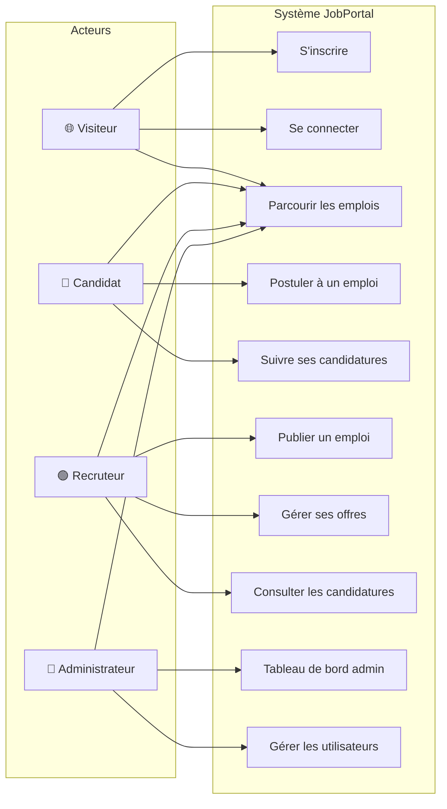
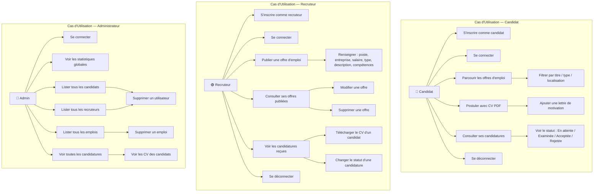
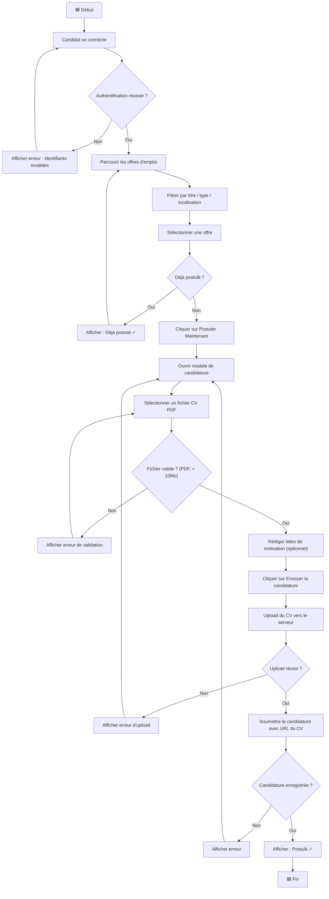
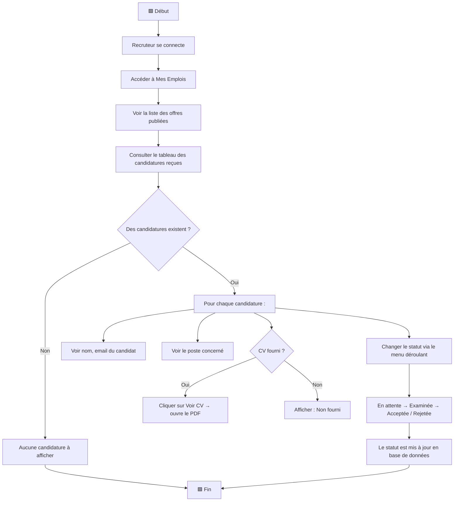
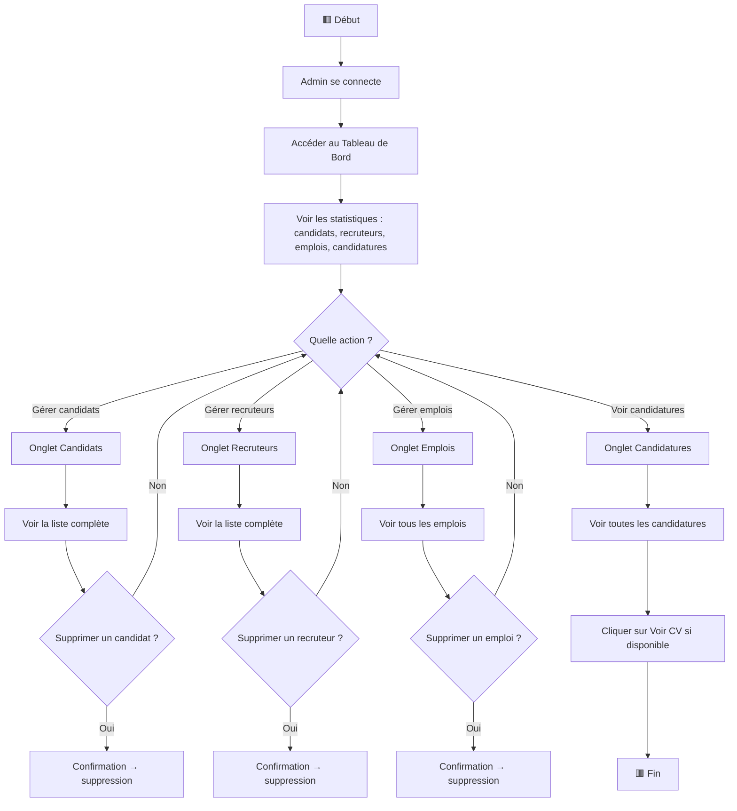
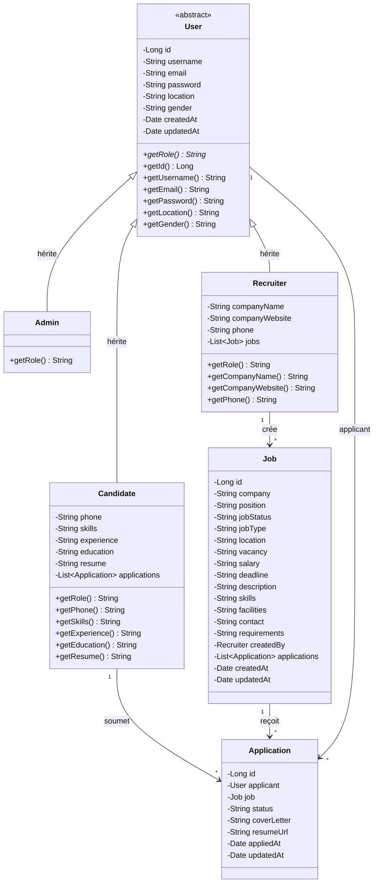

# 🏢 JobPortal — Plateforme de Recrutement en Ligne

## 📋 Table des Matières

1. [Présentation du Projet](#-présentation-du-projet)
2. [Technologies Utilisées](#-technologies-utilisées)
3. [Architecture du Projet](#-architecture-du-projet)
4. [Installation et Démarrage](#-installation-et-démarrage)
5. [Rôles et Fonctionnalités des Utilisateurs](#-rôles-et-fonctionnalités-des-utilisateurs)
6. [API REST — Endpoints et Méthodes](#-api-rest--endpoints-et-méthodes)
7. [Structure de la Base de Données](#-structure-de-la-base-de-données)
8. [Diagramme de Cas d'Utilisation Général](#-diagramme-de-cas-dutilisation-général)
9. [Diagramme de Cas d'Utilisation Détaillé](#-diagramme-de-cas-dutilisation-détaillé)
10. [Diagramme d'Activités](#-diagramme-dactivités)
11. [Diagramme de Classes](#-diagramme-de-classes)
12. [Services Angular (Frontend)](#-services-angular-frontend)
13. [Composants Angular (Frontend)](#-composants-angular-frontend)
14. [Sécurité](#-sécurité)

---

## 🎯 Présentation du Projet

**JobPortal** est une application web complète de gestion de recrutement qui permet de mettre en relation des **recruteurs** et des **candidats**. L'application offre un espace dédié pour chaque type d'utilisateur :

- **Les candidats** peuvent parcourir les offres d'emploi, postuler en joignant leur CV (PDF), et suivre l'état de leurs candidatures.
- **Les recruteurs** peuvent publier des offres d'emploi, consulter les candidatures reçues, télécharger les CV des candidats, et gérer le statut des candidatures.
- **L'administrateur** dispose d'un tableau de bord complet pour gérer l'ensemble des utilisateurs, des emplois et des candidatures.

L'interface utilisateur est entièrement en **français**.

---

## 🛠 Technologies Utilisées

| Couche | Technologie | Version |
|--------|-------------|---------|
| **Backend** | Spring Boot | 3.2.4 |
| **Frontend** | Angular | 17+ |
| **Base de Données** | MySQL (XAMPP) | 8.x |
| **Authentification** | JWT (JSON Web Token) | — |
| **Sécurité** | Spring Security | 6.2.3 |
| **ORM** | Hibernate / JPA | 6.4.4 |
| **Serveur Web** | Apache Tomcat (Embarqué) | 10.1.19 |

---

## 🏗 Architecture du Projet

Le projet suit une architecture **MVC (Modèle-Vue-Contrôleur)** avec séparation claire entre le backend et le frontend :

```
job-portal/
├── job-portal-spring-boot/          ← Backend (API REST)
│   └── src/main/java/com/app/jobportal/
│       ├── controller/              ← Contrôleurs REST
│       │   ├── AuthController.java
│       │   ├── JobController.java
│       │   ├── ApplicationController.java
│       │   ├── AdminController.java
│       │   └── FileController.java
│       ├── entity/                  ← Entités JPA
│       │   ├── User.java           (classe abstraite)
│       │   ├── Admin.java
│       │   ├── Candidate.java
│       │   ├── Recruiter.java
│       │   ├── Job.java
│       │   └── Application.java
│       ├── repository/              ← Interfaces JPA Repository
│       │   ├── UserRepository.java
│       │   ├── CandidateRepository.java
│       │   ├── RecruiterRepository.java
│       │   ├── JobRepository.java
│       │   └── ApplicationRepository.java
│       └── security/                ← Configuration sécurité
│           ├── SecurityConfig.java
│           ├── JwtUtil.java
│           ├── JwtRequestFilter.java
│           └── CustomUserDetailsService.java
│
└── job-portal-angular/              ← Frontend (SPA)
    └── src/app/
        ├── components/
        │   ├── navbar/
        │   └── footer/
        ├── pages/
        │   ├── home/
        │   ├── login/
        │   ├── register/
        │   ├── all-jobs/
        │   ├── add-job/
        │   ├── my-jobs/
        │   └── admin/
        └── services/
            ├── auth.service.ts
            ├── job.service.ts
            ├── application.service.ts
            └── admin.service.ts
```

---

## 🚀 Installation et Démarrage

### Prérequis

- **Java 17+** (JDK)
- **Node.js 18+** et **npm**
- **XAMPP** (MySQL)
- **Maven** (ou utiliser le wrapper `mvnw`)

### Étapes

**1. Base de données :**
```sql
-- Importer le fichier SQL dans phpMyAdmin (XAMPP)
-- Fichier : refactored_database.sql
-- Cela crée la base "job_portal" avec les tables et données de test
```

**2. Backend (Spring Boot) :**
```bash
cd job-portal-spring-boot
mvn spring-boot:run
# Le serveur démarre sur http://localhost:8080
```

**3. Frontend (Angular) :**
```bash
cd job-portal-angular
npm install
ng serve -o
# L'application s'ouvre sur http://localhost:4200
```

### Comptes de test

| Rôle | Email | Mot de passe |
|------|-------|-------------|
| Admin | `admin@jobportal.com` | `password123` |
| Recruteur | `rec.google@test.com` | `password123` |
| Candidat | `john.doe@test.com` | `password123` |

---

## 👥 Rôles et Fonctionnalités des Utilisateurs

### 🔵 Candidat (`ROLE_CANDIDATE`)

| Fonctionnalité | Description |
|----------------|-------------|
| S'inscrire | Créer un compte avec rôle "candidat" |
| Se connecter | Authentification par email/mot de passe |
| Parcourir les emplois | Voir toutes les offres d'emploi disponibles |
| Filtrer les emplois | Rechercher par titre, type, localisation |
| Postuler | Soumettre une candidature avec CV (PDF) et lettre de motivation |
| Suivre ses candidatures | Voir le statut de toutes ses candidatures (En attente, Examinée, Acceptée, Rejetée) |

### 🟢 Recruteur (`ROLE_RECRUITER`)

| Fonctionnalité | Description |
|----------------|-------------|
| S'inscrire | Créer un compte avec rôle "recruteur" |
| Se connecter | Authentification par email/mot de passe |
| Publier un emploi | Créer une offre avec tous les détails (poste, salaire, description, compétences...) |
| Mes emplois | Voir et gérer les offres publiées |
| Modifier un emploi | Mettre à jour les détails d'une offre |
| Supprimer un emploi | Retirer une offre du portail |
| Voir les candidatures | Consulter toutes les candidatures reçues sur ses offres |
| Télécharger un CV | Ouvrir le CV PDF d'un candidat |
| Gérer les statuts | Changer le statut d'une candidature (En attente → Examinée → Acceptée/Rejetée) |

### 🔴 Administrateur (`ROLE_ADMIN`)

| Fonctionnalité | Description |
|----------------|-------------|
| Tableau de bord | Voir les statistiques globales (nombre de candidats, recruteurs, emplois, candidatures) |
| Gérer les candidats | Voir la liste de tous les candidats et les supprimer |
| Gérer les recruteurs | Voir la liste de tous les recruteurs et les supprimer |
| Gérer les emplois | Voir et supprimer n'importe quel emploi |
| Voir les candidatures | Consulter toutes les candidatures avec les CV |

---

## 📡 API REST — Endpoints et Méthodes

### `AuthController` — `/api/v1/auth`

| Méthode | Endpoint | Accès | Description |
|---------|----------|-------|-------------|
| `POST` | `/register` | 🌐 Public | Inscription d'un nouvel utilisateur. Reçoit `username`, `email`, `password`, `role` (candidate/recruiter/admin). Crée l'entité correspondante et hashage le mot de passe avec BCrypt. |
| `POST` | `/login` | 🌐 Public | Authentification. Valide les identifiants, génère un **token JWT**, et retourne le token + les informations utilisateur (sans mot de passe). |

### `JobController` — `/api/v1/jobs`

| Méthode | Endpoint | Accès | Description |
|---------|----------|-------|-------------|
| `GET` | `/` | 🌐 Public | Retourne la liste de **tous les emplois** avec leurs détails et le recruteur associé. |
| `GET` | `/{id}` | 🌐 Public | Retourne les détails d'un **emploi spécifique** par son ID. |
| `GET` | `/my-jobs` | 🟢 Recruteur | Retourne les emplois **créés par le recruteur connecté**. Vérifie que l'utilisateur est bien un `Recruiter`. |
| `POST` | `/` | 🟢 Recruteur | **Crée un nouvel emploi**. Associe automatiquement le recruteur connecté comme auteur. Retourne l'emploi créé (HTTP 201). |
| `PATCH` | `/{id}` | 🟢 Recruteur | **Met à jour un emploi** existant. Vérifie que le recruteur connecté est bien l'auteur de l'offre. Met à jour uniquement les champs fournis (mise à jour partielle). |
| `DELETE` | `/{id}` | 🟢 Recruteur | **Supprime un emploi**. Vérifie que le recruteur connecté est bien l'auteur de l'offre. |

### `ApplicationController` — `/api/v1/applications`

| Méthode | Endpoint | Accès | Description |
|---------|----------|-------|-------------|
| `GET` | `/applicant-jobs` | 🔵 Candidat | Retourne toutes les **candidatures du candidat connecté** avec les détails de l'emploi associé. |
| `POST` | `/apply` | 🔵 Candidat | **Soumet une candidature**. Reçoit `jobId`, `resumeUrl` (optionnel), `coverLetter` (optionnel). Empêche les doublons (un candidat ne peut postuler qu'une fois par emploi). Retourne la candidature créée (HTTP 201). |
| `GET` | `/recruiter-jobs` | 🟢 Recruteur | Retourne toutes les **candidatures reçues** sur les emplois du recruteur connecté. Utilise une requête JPQL pour filtrer par `job.createdBy.id`. |
| `PATCH` | `/{id}` | 🟢 Recruteur | **Met à jour le statut** d'une candidature (PENDING → REVIEWED → ACCEPTED/REJECTED). Vérifie que le recruteur est bien l'auteur de l'offre concernée. |

### `FileController` — `/api/v1/files`

| Méthode | Endpoint | Accès | Description |
|---------|----------|-------|-------------|
| `POST` | `/upload-cv` | 🔵 Candidat | **Télécharge un fichier CV** (PDF uniquement, 10 Mo max). Génère un nom unique (UUID), sauvegarde dans `uploads/cvs/`, et retourne l'URL d'accès. |
| `GET` | `/cv/{filename}` | 🌐 Public | **Sert un fichier CV** sauvegardé. Retourne le PDF avec le content-type approprié. Accessible sans authentification (les noms de fichiers sont basés sur UUID donc impossibles à deviner). |

### `AdminController` — `/api/v1/admin`

| Méthode | Endpoint | Accès | Description |
|---------|----------|-------|-------------|
| `GET` | `/stats` | 🔴 Admin | Retourne les **statistiques globales** : nombre total de candidats, recruteurs, emplois, candidatures. |
| `GET` | `/candidates` | 🔴 Admin | Retourne la **liste de tous les candidats** avec leurs informations (compétences, expérience, éducation). |
| `GET` | `/recruiters` | 🔴 Admin | Retourne la **liste de tous les recruteurs** avec les informations entreprise. |
| `GET` | `/jobs` | 🔴 Admin | Retourne la **liste de tous les emplois** du portail. |
| `GET` | `/applications` | 🔴 Admin | Retourne **toutes les candidatures** avec candidat, emploi et CV associés. |
| `DELETE` | `/users/{id}` | 🔴 Admin | **Supprime un utilisateur** (candidat ou recruteur). Interdit la suppression d'un admin. |
| `DELETE` | `/jobs/{id}` | 🔴 Admin | **Supprime n'importe quel emploi**, quel que soit son auteur. |

---

## 🗃 Structure de la Base de Données

La base utilise une stratégie d'héritage **TABLE_PER_CLASS** pour les utilisateurs :

| Table | Description |
|-------|-------------|
| `user_seq` | Générateur d'ID partagé entre les tables utilisateur |
| `admins` | Utilisateurs administrateurs |
| `recruiters` | Recruteurs avec `company_name`, `company_website`, `phone` |
| `candidates` | Candidats avec `skills`, `experience`, `education`, `resume`, `phone` |
| `jobs` | Offres d'emploi (liées à `recruiters` via `created_by_id`) |
| `applications` | Candidatures (liées à `candidates` via `applicant_id` et `jobs` via `job_id`) |

---

## 📊 Diagramme de Cas d'Utilisation Général



---

## 📊 Diagramme de Cas d'Utilisation Détaillé



---

## 📊 Diagramme d'Activités

### Activité : Candidature à un emploi



### Activité : Gestion des candidatures par le recruteur



### Activité : Administration du portail



---

## 📊 Diagramme de Classes



### Relations entre les entités :

| Relation | Type | Description |
|----------|------|-------------|
| `User` → `Admin` | **Héritage** (TABLE_PER_CLASS) | L'admin hérite de tous les attributs de User |
| `User` → `Candidate` | **Héritage** (TABLE_PER_CLASS) | Le candidat ajoute : compétences, expérience, éducation, CV |
| `User` → `Recruiter` | **Héritage** (TABLE_PER_CLASS) | Le recruteur ajoute : nom entreprise, site web, téléphone |
| `Recruiter` → `Job` | **OneToMany** | Un recruteur peut créer plusieurs emplois |
| `Job` → `Application` | **OneToMany** | Un emploi peut recevoir plusieurs candidatures |
| `User` → `Application` | **ManyToOne** | Un candidat peut soumettre plusieurs candidatures |
| (`Candidate`, `Job`) | **Contrainte unique** | Un candidat ne peut postuler qu'une seule fois par emploi |

---

## 🔧 Services Angular (Frontend)

### `AuthService` — Gestion de l'authentification

| Méthode | Description |
|---------|-------------|
| `register(user)` | Appelle `POST /api/v1/auth/register` pour inscrire un utilisateur |
| `login(credentials)` | Appelle `POST /api/v1/auth/login` et stocke le token JWT + user dans `localStorage` |
| `logout()` | Supprime le token et les données utilisateur du `localStorage` |
| `isLoggedIn()` | Vérifie si un token existe dans le `localStorage` |
| `getToken()` | Retourne le token JWT stocké |
| `getUser()` | Retourne l'objet utilisateur depuis le `localStorage` |
| `getUserRole()` | Retourne le rôle de l'utilisateur connecté (`candidate`, `recruiter`, `admin`) |

### `JobService` — Gestion des emplois

| Méthode | Description |
|---------|-------------|
| `getAllJobs()` | Récupère tous les emplois (`GET /api/v1/jobs`) |
| `getJobById(id)` | Récupère un emploi par son ID |
| `getMyJobs()` | Récupère les emplois du recruteur connecté |
| `addJob(job)` | Crée un nouvel emploi (`POST /api/v1/jobs`) |
| `updateJob(id, job)` | Met à jour un emploi (`PATCH /api/v1/jobs/{id}`) |
| `deleteJob(id)` | Supprime un emploi (`DELETE /api/v1/jobs/{id}`) |

### `ApplicationService` — Gestion des candidatures

| Méthode | Description |
|---------|-------------|
| `applyForJob(payload)` | Soumet une candidature (`POST /api/v1/applications/apply`) |
| `getApplicantJobs()` | Récupère les candidatures du candidat connecté |
| `getRecruiterJobs()` | Récupère les candidatures reçues par le recruteur |
| `updateStatus(id, status)` | Met à jour le statut d'une candidature (`PATCH`) |
| `uploadCv(file)` | Télécharge un fichier CV PDF via `FormData` (`POST /api/v1/files/upload-cv`) |

### `AdminService` — Gestion administrative

| Méthode | Description |
|---------|-------------|
| `getStats()` | Récupère les statistiques globales |
| `getCandidates()` | Liste tous les candidats |
| `getRecruiters()` | Liste tous les recruteurs |
| `getJobs()` | Liste tous les emplois |
| `getApplications()` | Liste toutes les candidatures |
| `deleteUser(id)` | Supprime un utilisateur |
| `deleteJob(id)` | Supprime un emploi |

---

## 🖥 Composants Angular (Frontend)

| Composant | Route | Description |
|-----------|-------|-------------|
| `HomeComponent` | `/` | Page d'accueil avec présentation du portail, statistiques et appels à l'action |
| `LoginComponent` | `/login` | Formulaire de connexion (email + mot de passe) |
| `RegisterComponent` | `/register` | Formulaire d'inscription avec sélection du rôle (Candidat / Recruteur) |
| `AllJobsComponent` | `/all-jobs` | Liste de toutes les offres avec filtres (recherche, type, localisation) et modale de candidature avec upload CV |
| `AddJobComponent` | `/add-job` | Formulaire de création d'offre d'emploi (réservé aux recruteurs) |
| `MyJobsComponent` | `/my-jobs` | **Recruteur** : liste de ses offres + tableau des candidatures reçues avec lien CV. **Candidat** : liste de ses candidatures avec statut |
| `AdminComponent` | `/admin` | Tableau de bord administrateur avec cartes statistiques et 4 onglets (Candidats, Recruteurs, Emplois, Candidatures) |
| `NavbarComponent` | — | Barre de navigation adaptative selon le rôle (liens différents pour candidat, recruteur, admin) |
| `FooterComponent` | — | Pied de page du site |

---

## 🔒 Sécurité

### Authentification JWT

1. L'utilisateur se connecte avec email/mot de passe
2. Le serveur valide les identifiants et génère un **token JWT**
3. Le token est stocké côté client dans le `localStorage`
4. Chaque requête API inclut le token dans le header `Authorization: Bearer <token>`
5. Le `JwtRequestFilter` intercepte chaque requête, extrait le token, et authentifie l'utilisateur

### Contrôle d'accès par rôle

| Ressource | Visiteur | Candidat | Recruteur | Admin |
|-----------|----------|----------|-----------|-------|
| Inscription / Connexion | ✅ | ✅ | ✅ | ✅ |
| Voir les emplois | ✅ | ✅ | ✅ | ✅ |
| Postuler | ❌ | ✅ | ❌ | ❌ |
| Publier un emploi | ❌ | ❌ | ✅ | ❌ |
| Gérer ses offres | ❌ | ❌ | ✅ | ❌ |
| Voir les candidatures reçues | ❌ | ❌ | ✅ | ✅ |
| Télécharger un CV | ✅ | ✅ | ✅ | ✅ |
| Tableau de bord admin | ❌ | ❌ | ❌ | ✅ |
| Supprimer des utilisateurs | ❌ | ❌ | ❌ | ✅ |

### Hashage des mots de passe

Les mots de passe sont hashés avec **BCrypt** avant le stockage en base de données. Le mot de passe en clair n'est jamais stocké ni retourné dans les réponses API.

---

## 📄 Licence

Ce projet a été développé dans un cadre éducatif. Tous droits réservés.
# jobPortalangularSpring

